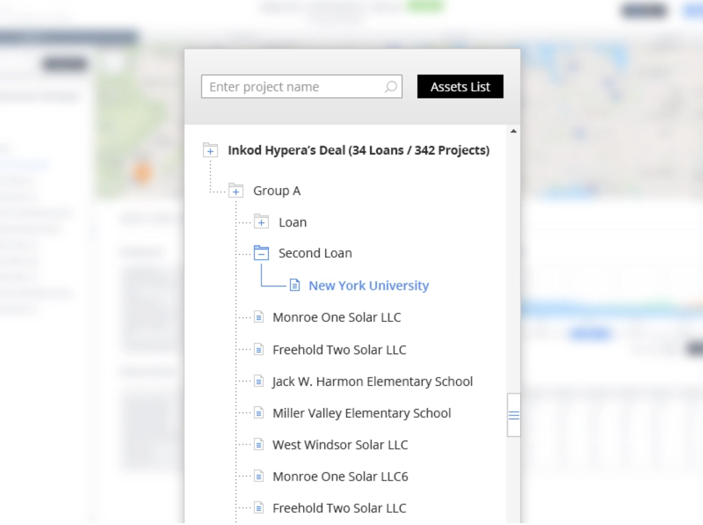

# Treeview component exercise

You goal is to create a treeview component as the design:

## The component should:
- get a js object representing the data hirarchy as a prop
- support collapsing and expanding each level of the tree
- display the expanded / collapsed statuses (with proper icons)
- distinguish directories from files
- support vertical scrolling inside the fixed size component
- filter the results by the search input

** The icons library [HeroIcons](https://github.com/tailwindlabs/heroicons) is already installed